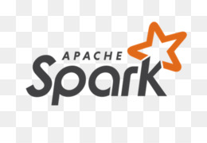

### Hi there, I'm Thanh Phat 👋

- 🔭 I’m currently studying at Ho Chi Minh City University of Technology and Education
- 🌱 I’m currently learning Data Engineer
- 📫 How to reach me: phatnguyen080401@gmail.com
- ⚡ Fun fact: I love to learn new Big Data technologies 

### Connect with me:

[][gmail]
[][github]
[][linkedin]
[][facebook]

 

<em>Don't hesitate to get in touch!</em>

---

### Languages and Tools:

[<code>

</code>](https://www.python.org/)
[<code>

</code>](https://www.scala-lang.org/)
[<code>

</code>](https://kafka.apache.org/)
[<code>

</code>](https://spark.apache.org/)
[<code>

</code>](https://airflow.apache.org/)
[<code>

</code>](https://www.getdbt.com/)
---

[gmail]: phatnguyen080401@gmail.com
[github]: https://github.com/phatnguyen080401
[linkedin]: https://www.linkedin.com/in/th%C3%A0nh-ph%C3%A1t-nguy%E1%BB%85n-0bba27217/
[facebook]: https://www.facebook.com/thanhphat.nguyen.182/